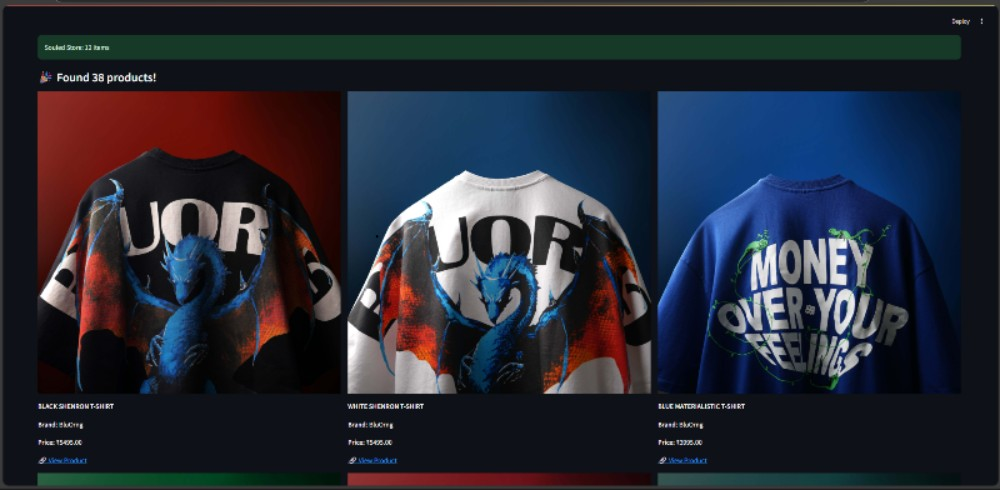
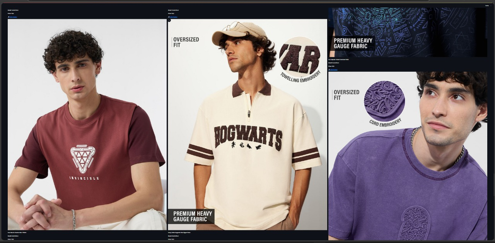
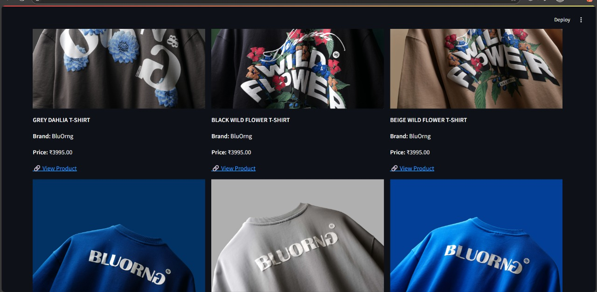

### 🔍 Example Output Screenshot


### 🔍 Example Output Screenshot


### 🔍 Example Output Screenshot



# 🧢 Multi-Brand Product Price Aggregator

This project is a **T-shirt Price Aggregator** built using **Python, Streamlit**, and **Playwright**. It scrapes and displays products from three popular Indian fashion websites:

- **BluOrng**
- **Bewakoof**
- **Souled Store**

Users can search for T-shirts and view details such as product name, brand, price, link, and image — all in a clean, responsive grid layout.

---

## 🔍 Features

- Scrapes real-time data from 3 fashion sites using **Playwright**
- Filters and shows only valid product entries with images
- Displays products in a 3-column responsive card layout
- Highlights total products fetched
- Excludes products with missing or placeholder images
- Includes basic insights: cheapest and costliest product (if enabled)
- Works perfectly on **local machines**

---

## ⚙️ How It Works

Each site has its own scraper script under the `scrapers/` directory:
- `bluorng.py` — fetches products using Shopify JSON endpoint
- `bewakoof.py` — uses Playwright to render JS content and scrape cards
- `souledstore.py` — also uses Playwright to scrape rendered product tiles

The main `app.py` handles:
- UI input via Streamlit
- Calling each scraper using `subprocess`
- Merging results into a unified view
- Filtering products missing images
- Optional price-based analysis

---

## 🚀 You can this repo  Locally
> ⚠️ Requires Python 3.10+ and Chrome installed (Playwright uses Chromium)
1. Clone this repo  
   ```bash
   git clone https://github.com/AryanSingh2029/t-shirt-scraping.git
   cd t-shirt-scraping

2.Install dependencies
pip install -r requirements.txt
playwright install

3. Run the Streamlit app
 streamlit run app.py

4.search for t-shirt


⚠️ Why It Doesn’t Work on Streamlit Cloud
This app uses Playwright, which launches a real browser instance (Chromium) to scrape dynamic JavaScript content.

✅ Works on local machine
❌ Not supported on Streamlit Cloud because it doesn’t allow launching browsers like Chromium (used by Playwright).

